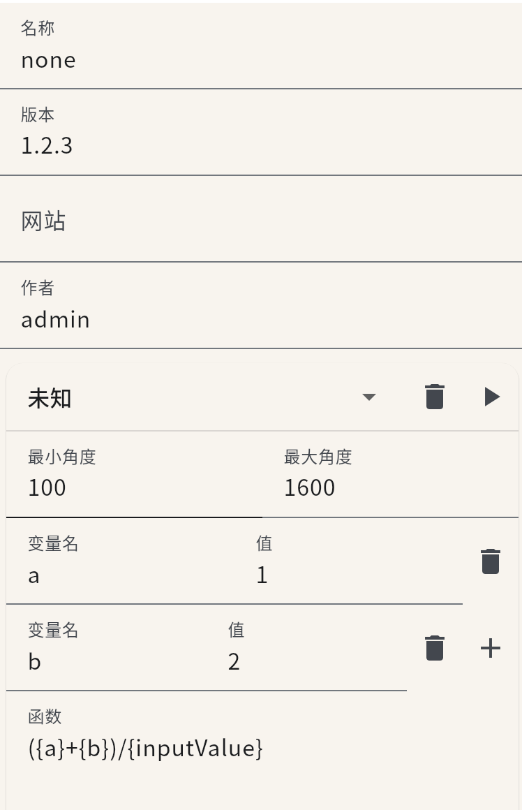
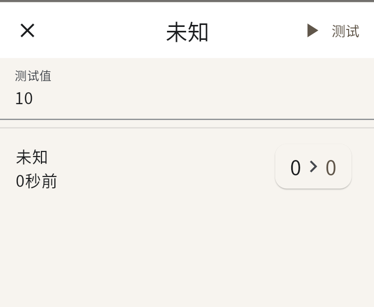

# 创建

---

允许用户创建计算函数清单, 选择你的方式

---

## 方案一: 应用内



打开应用在设置>计算配置>创建， 应用内置可视化编辑窗口，提供测试

## 方案二: 外部


创建一个`youName.json`,如果你在手机内，需要额外ide程序协助你编写,格式请参考[**这里**](./configTable.md),
当然以最低限度json是这样:

[example](/config/calcFunction/example.json).json

```json
{
  "name": "example-calc",
  "version": "0.0.1",
  "author": "example",
  "website": "example.com",
  "updataFunction": [
    {
      "name": "github path",
      "path": "https://raw.githubusercontent.com/hell-gun-calculator/document/main/config/calcFunction/example.json"
    }
  ],
  "child": {
    "Germany": {
      "maximumRange": 1600,
      "minimumRange": 100,
      "envs": {
        "m": -0.237035714285714,
        "b": 1001.46547619048
      },
      "fun": "{m}*{inputValue}+{b}"
    },
    "TheSovietUnion": {
      "maximumRange": 1600,
      "minimumRange": 100,
      "envs": {
        "m": -0.2136691176,
        "b": 1141.7215
      },
      "fun": "{m}*{inputValue}+{b}"
    },
    "GreatBritain": {
      "maximumRange": 1600,
      "minimumRange": 100,
      "envs": {
        "m": -0.1773,
        "b": 550.69
      },
      "fun": "{m}*{inputValue}+{b}"
    }
  }
}
```

保存后，打开应用在设置>计算配置>外部导入计算配置清单


## 测试

测试你的计算函数



